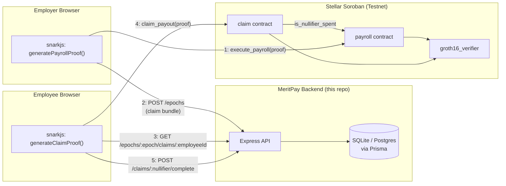

# MeritPay Backend

Minimal persistence API for MeritPay, a zero-knowledge, performance-linked payroll system on Stellar Soroban. See `hack.md` and `CLAUDE.md` for the full project architecture.

## Why this exists

MeritPay's ZK/Soroban flow is fully client-side: proofs are generated in the browser and transactions go straight to Soroban. Two pieces of state were only ever kept in browser `localStorage`, which means they don't survive across devices or sessions:

1. The **claim bundle** — each employee's nullifier, payout amount, and Groth16 proof, produced after the employer executes payroll (Step 1) and needed by the employee to claim (Step 2).
2. The **claimed-nullifiers flag** — which claims have already been submitted.

This service replaces both with a real API + database, plus a place to persist the employer's employee configuration (name, base salary, hours threshold) between sessions.

**Privacy note:** this backend never stores raw KPI inputs (hours worked, sales figures) — those never leave the employee's browser in the ZK design, and persisting them here would defeat the point. It only stores employer-set config and data that is already public once posted on-chain (nullifiers, proofs, public signals, amounts in stroops).

## Architecture

This backend sits alongside the on-chain verification path, not inside it — Soroban is still the source of truth for whether a proof is valid and a nullifier is spent. The API only persists what the browsers would otherwise lose to `localStorage`.



1. The employer generates the payroll proof and submits it to the `payroll` contract, which verifies it via `groth16_verifier` and moves escrow.
2. The employer publishes the resulting claim bundle to this API instead of `localStorage`.
3. Each employee fetches their own claim entry (proof, public signals, amount) from the API.
4. The employee submits their claim proof to the `claim` contract, which independently re-verifies it and checks `is_nullifier_spent` against the `payroll` contract.
5. The employee reports the completed claim back to the API so the status mirror stays in sync.

## Stack

Node.js + Express + TypeScript + Prisma. Defaults to SQLite for local dev; point `DATABASE_URL` at Postgres to swap without code changes (update `provider` in `prisma/schema.prisma` to `"postgresql"` first).

## Setup

```bash
npm install
cp .env.example .env
npm run db:migrate   # creates the SQLite DB from prisma/schema.prisma
npm run dev           # http://localhost:4000
```

## API

All bodies are JSON; validation is via `zod` and returns `400` with `details` on failure.

### `GET /health`
Liveness check.

### Employees (employer dashboard persistence)

- `POST /employees` — upsert, keyed on `(employerWallet, employeeId)`.
  ```json
  { "employerWallet": "G...", "employeeId": 1, "name": "Alice", "baseSalary": 30000, "hoursThreshold": 160, "bonusRateHours": 20, "bonusRateSales": 10 }
  ```
  `baseSalary` is in circuit units (XLM × 1000), matching the unit table in `CLAUDE.md`.
- `GET /employees?employerWallet=G...` — list an employer's configured employees.
- `DELETE /employees/:id`.

### Epochs / claim bundles (replaces the localStorage `ClaimBundle`)

- `POST /epochs` — create an epoch and its claim bundle in one call, right after `execute_payroll` succeeds on-chain.
  ```json
  {
    "epoch": 1,
    "employerWallet": "G...",
    "totalPayroll": "300000000",
    "txHash": "...",
    "claimEntries": [
      { "employeeId": 1, "employeeName": "Alice", "nullifier": "...", "amountStroops": "300000000", "proof": { ... }, "publicSignals": ["...", "...", "..."] }
    ]
  }
  ```
- `GET /epochs/:epoch` — epoch metadata + all claim entries.
- `GET /epochs/:epoch/claims/:employeeId` — the one claim entry an employee needs (proof + public signals + amount) to call `claim_payout`.

### Claims (replaces the `meritpay:claimed-nullifiers` localStorage flag)

- `POST /claims/:nullifier/complete` — `{ "txHash": "..." }`, marks a claim as completed after a successful on-chain `claim_payout` tx.
- `GET /claims/:nullifier` — claim status lookup.

Note: the true authority for whether a nullifier is spent is always the on-chain check (`payroll.is_nullifier_spent`). The `claimed` flag here is a read-optimized mirror for the frontend, not a security boundary.

## Limitations (MVP scope)

- No auth — `employerWallet` is a client-supplied identifier, not verified against a signature. Fine for a hackathon MVP; would need wallet-signature auth before handling real funds.
- No auditor-disclosure endpoint — that flow is fully client-side proof generation/verification with nothing to persist, per `hack.md`.
- SQLite by default; swap to Postgres via `DATABASE_URL` + the `provider` field in `prisma/schema.prisma` for production.
